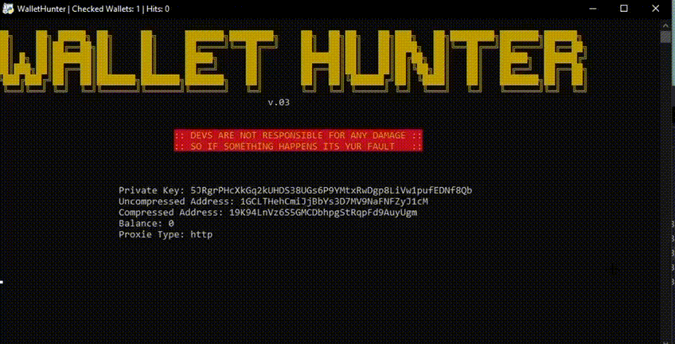

<b> 

<b> 

WalletHunter is a program that hunts down Wallets and searching for bitcoin

<b> 

<h2>WalletHunter FAQ:</h2>
<b> • How does WalletHunter get wallets? 
<b> WalletHunter use <a href="https://bitcoinlist.io/">bitcoinlist.io</a> to get the wallets. 
<b> 
<b> • What is <a href="https://bitcoinlist.io/">bitcoinlist.io</a>? 
<b><a href="https://bitcoinlist.io/">bitcoinlist.io</a> is a website that shows millions of trillions wallets and with luck you get a wallet with btc on it. 
<b> 
<b> • Is WalletHunter legal?  
<b>No because programs with types of this are in the catogiry "hacking" and wallet mining is like a bruteforce attack so it is illegal but if you want to use it you can use it no one will stop you but DEVS ARE NOT RESPONSIBLE FOR ANY DAMAGE. 
<b> 
<b> 
<h2>WalletHunter features:</h2>
<b> • Discord-Webhook are supported. 
<b> • Log-system is built in. (its not perfect but its get overedited soon. / You can disable it in config.ini) 
<b> • Config file is built in. 
<b> • Proxies are supported. (they get always scraped after restarting WalletHunter) 
<b> • More comming soon. 
<b> 
<b> 
<h2>Requirements:</h2>
<b> • requests 
<b> • bs4 
<b> • time 
<b> • os  
<b> • colorama  
<b> • configparser  
<b> • random  

<b> 
<b> 
<h2>Special thanks:</h2>
<b>Special thanks to <a href="https://github.com/cloutjs">cloutjs</a> for making <a href="https://github.com/cloutjs/ByeBye-Bitcoin">ByeBye-Bitcoin</a>! <3 
<b>So my point is WalletHunter is <a href="https://github.com/cloutjs/ByeBye-Bitcoin">ByeBye-Bitcoin</a> just over edited.  
<b>Please check <a href="https://github.com/cloutjs">cloutjs</a> out! 
  <b>- 
<b>And special thanks to <a href="https://bitcoinlist.io/">bitcoinlist.io</a> for making this website! <3 

<b> 
<b> 

  <h2>A quick look from WalletHunter:</h2>

